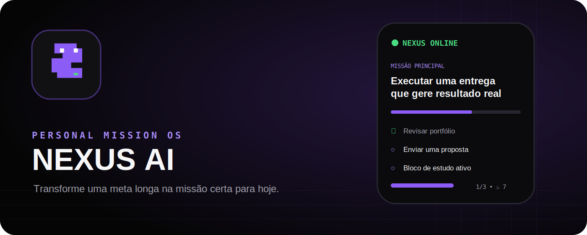
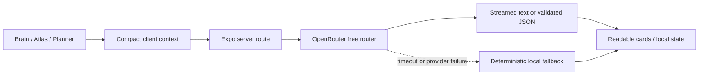
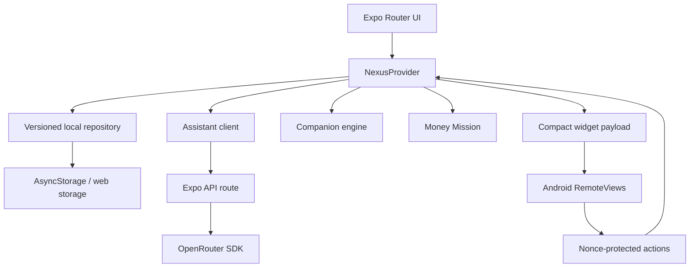

<div align="center">



# Nexus AI 2.3 · Widget Family

### A local-first Personal Mission OS that turns ambition into the next clear action.

<p>
  <a href="https://github.com/Guuh-dev/Nexus-AI-v2/actions/workflows/ci.yml"></a>
  <a href="https://github.com/Guuh-dev/Nexus-AI-v2/actions/workflows/security.yml"></a>
  
  
  
  
</p>

<p>
  <a href="#why-nexus">Why Nexus</a> ·
  <a href="#whats-new-in-22">What’s new</a> ·
  <a href="#widget-studio-22">Widgets</a> ·
  <a href="#architecture">Architecture</a> ·
  <a href="#getting-started">Run it</a> ·
  <a href="#release-system">Release system</a>
</p>

</div>

---

## Why Nexus

Most productivity apps store tasks. Nexus tries to understand the person behind them.

It combines goals, routine, energy, available time, learning, money targets and progress into one execution loop:

```text
Ambition
   ↓
Personal diagnosis + current reality
   ↓
One main mission for today
   ↓
Clear tasks + focus block + proof of completion
   ↓
XP, memory, review and the next realistic action
```

Nexus is designed as a **Personal Mission OS**, not a generic to-do list. It is local-first, works without an account and remains useful when the AI provider is unavailable.

> **Built for execution:** every useful recommendation should answer five questions: what, why, how, what to deliver and when it is truly done.

## What’s new in 2.3

Nexus now ships a real Android widget family instead of forcing every experience into one compact provider.

- Five picker entries: Mini, Strip, Companion, Mission and Command.
- Purpose-built 1×1, 2×1, 2×2, 4×1, 4×2 and 4×4 compositions.
- True transparent, frosted and card surfaces.
- Reactive Companion poses contained inside the widget, with no continuous background loop.
- Shared local data, secure actions and independent configuration per instance.
- Nexus Flow 2.2.1 chat improvements: fixed composer, virtualized history and faster AI fallback.

Version 2.3.1 polishes the native widget family and repairs the Brain/Atlas reliability path, so it requires a new base APK. Compatible follow-up fixes can use OTA while the runtime stays on 2.3.1.

### 2.3.1 — Recovery & Widget Polish

- Blocks leaked model reasoning, English internal instructions and oversized Atlas answers before they reach the UI.
- Keeps Atlas to one practical step and at most one question per turn.
- Requires remotely generated structured roadmaps and weekly reviews before marking them as AI output; local fallback remains explicit.
- Fixes Android keyboard occlusion without double-resize gaps and preserves the reader's position in long conversations.
- Rebuilds the five native widget families with safer spacing, responsive content density, larger mascots and per-instance visual controls.
- Makes opacity, alignment, privacy, task count and mascot choices match the real Android widget instead of only the Studio preview.

---

## What’s new in 2.2

### 🐍 Nexus Companion

The mascot is now an active execution companion instead of decoration.

- Seven personalities: happy, playful, motivational, serious, strict, calm and quiet.
- Three presence levels: quiet, balanced and active.
- Contextual reactions to progress, completed days, stalled missions and offline mode.
- User-controlled voice: fun, motivational, contextual or silent.
- Independent personality, style, accessory and speech configuration for every Android widget instance.
- Redesigned pixel art, clearer expressions, two new companions (Orbit and Ember) and more recognizable accessories.

A happy Companion and a strict Companion can live side by side on the same home screen because every widget stores its own configuration.

### ⚡ Brain and Professor Atlas

The assistant experience was rebuilt around clarity and speed.

- Server-sent streaming makes answers appear progressively instead of arriving as one large block.
- Brain answers are compact by default and optimized for the next action.
- Atlas teaches one step at a time with a clear goal, action, deliverable and completion criterion.
- Long Markdown is rendered as readable headings, steps and short paragraphs.
- Quick actions can simplify an answer, turn it into a task or request guided execution.
- User-selectable Atlas styles: teacher, mentor, coach, strict or friendly.
- User-selectable response density: compact, balanced or detailed.
- Sanitized diagnostics record source, model, latency and attempt count without exposing prompts or secrets.

### 🧩 Widget Studio 2.2

The widget system now covers execution, learning, focus, gamification, habits, money and Companion presence.

**16 presets are included:**

| Category | Presets |
| --- | --- |
| Execution | Mission Card, Smart Plan, Daily Command, Do It Now |
| Focus | Focus Card |
| Learning | Atlas Lesson, Roadmap Pulse |
| Companion | Nexus Companion, Nexus Quote, Quiet Status |
| Progress | XP Core, Streak Flame, Boss Battle |
| Routine | Habit Grid |
| Money | Money Mission, Freelance Radar |

Every instance can independently choose:

- content mode;
- size and density;
- Nexus, AMOLED, transparent, glass, pixel, minimal, gamer, neon, mascot, privacy or Light Clean style;
- accent, border, corners, glow, opacity, alignment and font scale;
- mascot, Companion mood, speech style and accessory;
- tap destination;
- task count and visible metrics;
- privacy mode;
- multi-page cycling.

The native widget supports direct task completion with nonce validation and idempotent XP synchronization.

### 💸 Money Mission

A lightweight local-first freelance dashboard tracks:

- monthly revenue and goal;
- today’s prospects;
- pending follow-ups;
- active clients;
- closed deals.

The same state can power the in-app Money Mission screen and finance widgets without sending private business data to a third party.

### 🎨 Stronger visual identities

Themes now affect complete visual systems instead of only changing one accent color.

- Nexus
- AMOLED
- One UI
- HUD
- Aurora
- Ocean
- Ember
- Rose
- Monochrome
- Light Clean
- Custom

The system coordinates backgrounds, surfaces, borders, glow, tab bar, system bar, cards, inputs and widget previews. Light widget previews also use their own readable text palette.

---

## Core experience

| Area | What it does |
| --- | --- |
| Deep onboarding | Eight-stage diagnosis covering identity, mission, reality, energy, blockers, learning and execution. |
| Daily planning | Builds one main mission with priorities, time estimates, XP and concrete proof of completion. |
| Nexus Brain | Persistent contextual conversations, controlled memories and confirm-before-apply actions. |
| Professor Atlas | Interviews the learner, creates adaptive roadmaps and teaches through practical proof. |
| Focus OS | Sprint, Pomodoro, deep work, flow and custom sessions with recovery after app closure. |
| Operations | Multi-stage objectives, milestones and deadlines. |
| Habits | Local routines, individual streaks and daily completion. |
| Weekly planning | Capacity view, overload warnings and movable scheduled tasks. |
| Progression | XP, levels, attributes, achievements, streaks, challenges and Boss Battles. |
| Quick Capture | Fast task creation from the app and widget entry points. |
| Backup | Validated JSON export/import with selective corruption recovery. |
| OTA updates | Preview, production, rollback and runtime-safe change classification. |
| Offline mode | Deterministic planning and continued execution without AI or network access. |

---

## A clear AI contract

The OpenRouter key exists only on the server. The client receives no API key and never instantiates the provider SDK.



The assistant layer applies:

1. schema validation and payload limits;
2. history and context compaction;
3. server-side provider routing;
4. streaming for conversational modes;
5. structured validation for plans and actions;
6. retry only for temporary failures;
7. a deterministic local fallback;
8. sanitized diagnostics without private content.

No profile, conversation or roadmap is uploaded for permanent storage by Nexus. Only the minimum context required for the current request is sent to the configured AI endpoint.

---

## Widget Studio 2.2

The widget is a real Android `RemoteViews` implementation, not a screenshot or web view.

### Native capabilities

- adaptive layouts from 1×1 through 5×2;
- multiple independent widget instances;
- direct task completion;
- secure page cycling;
- mission, task, learning, focus, XP, streak, habits, Boss Battle, Companion and finance modes;
- tap routes to Today, Brain, Focus, Capture, Progress, Finance, Habits and Week;
- compact local payload with no API key or full profile;
- synchronization whenever relevant app state changes.

Native widget changes require a new APK. Later JavaScript-only improvements that keep runtime `2.3.0` can ship through OTA.

Read [the Android widget guide](docs/ANDROID_WIDGET.md) and [the Widget Studio 2.2 guide](docs/WIDGET_STUDIO_2_2.md).

---

## Local-first and private by design

Nexus does not require login.

- Profile, tasks, XP, chats, roadmaps, habits and finance state live on the device.
- Storage is versioned, validated and migrated with pre-migration backup.
- Corrupted sections are recovered independently instead of deleting the entire user history.
- AI actions require confirmation before modifying the plan.
- Native widgets receive only a compact payload.
- `.env`, provider keys and Expo tokens are never included in client storage or widget data.

Read [SECURITY.md](SECURITY.md) and [PRIVACY.md](PRIVACY.md).

---

## Architecture

```text
app/                    Expo Router screens, tabs and server API routes
components/             UI primitives, assistant renderer, mascot and widget preview
features/assistant/     Message parsing and response presentation
features/companion/     Mood, presence and contextual speech engine
features/widget/        Preset catalog
features/widgets/       Widget visual tokens
providers/              Local-first state and atomic mutations
schemas/                Zod contracts for storage and API boundaries
services/               AI, storage, widgets, updates, backup and notifications
modules/nexus-widget/   Kotlin Android RemoteViews module
scripts/                Release, security and native-change checks
tests/                  Domain, API, UI, security, OTA and native regressions
docs/                   Architecture, release, testing and widget guides
```



More detail: [docs/ARCHITECTURE.md](docs/ARCHITECTURE.md).

---

## Getting started

### Requirements

- Node.js `22.13+ <23`
- pnpm `10.0.0`
- Android Studio only for local native builds
- an Expo project/token only for EAS Build or EAS Update

```bash
corepack enable
corepack prepare pnpm@10.0.0 --activate
pnpm install --frozen-lockfile
cp .env.example .env
pnpm run web
```

Server-side AI is optional. Without a key, Nexus continues with local planning.

```env
OPENROUTER_API_KEY=server_only_secret
OPENROUTER_ALLOW_PAID_FALLBACK=false
```

Never expose the provider key through `EXPO_PUBLIC_*`.

### Useful commands

```bash
pnpm run typecheck
pnpm run lint
pnpm test
pnpm run security:secrets
pnpm run release:check
pnpm run export:web
pnpm run verify
bash scripts/verify-native-widget.sh
```

---

## Release system

Nexus uses a protected release train:

```text
feature/release branch
        ↓
Pull Request
        ↓
CI + Security + Native Change Detector
        ↓
JavaScript-only change → EAS Update preview → production promotion
Native/runtime change   → EAS Build → new APK → new runtime baseline
```

Version `2.3.0` changes the native widget providers and runtime, so it requires a new base APK. Once that APK is installed, compatible `2.3.x` JavaScript and TypeScript improvements can arrive over the air.

Available workflows:

- **Nexus CI**
- **Nexus Security**
- **Nexus Native Change Detector**
- **Nexus OTA Preview**
- **Nexus OTA Production**
- **Nexus OTA Rollback**
- **Nexus Android Build**
- **Nexus Release**

Read [docs/DEPLOYMENT.md](docs/DEPLOYMENT.md).

---

## Verification

The 2.2 release includes automated coverage for:

- streaming assistant UX and compact prompts;
- Brain and Atlas fallback behavior;
- Companion personalities and deterministic contextual lines;
- Widget Studio presets and per-instance configuration;
- nonce-protected native actions;
- storage v5 migration;
- task and XP idempotency;
- onboarding recovery and timeout watchdogs;
- untrusted payload depth, complexity and prototype-pollution keys;
- OTA/runtime configuration and native-change classification;
- React Native Web style safety;
- secret scanning and workflow input hardening.

Read [docs/TESTING.md](docs/TESTING.md).

---

## Documentation

- [Nexus 2.2 release notes](docs/V2_2_RELEASE.md)
- [Nexus 2.3 Widget Family release notes](docs/V2_3_RELEASE.md)
- [Companion system](docs/COMPANION.md)
- [Widget Studio 2.2](docs/WIDGET_STUDIO_2_2.md)
- [Architecture](docs/ARCHITECTURE.md)
- [Android widget](docs/ANDROID_WIDGET.md)
- [Deployment](docs/DEPLOYMENT.md)
- [Testing](docs/TESTING.md)
- [Changelog](CHANGELOG.md)
- [Security](SECURITY.md)
- [Privacy](PRIVACY.md)

---

## Roadmap

- [x] Daily planning, execution, offline fallback and progress.
- [x] Brain, Professor Atlas, operations, habits, Focus OS and Widget Studio.
- [x] OTA release train, rollback and native-change detection.
- [x] Nexus Companion, streaming assistant UX, finance dashboard and Widget Studio 2.2.
- [ ] Optional encrypted multi-device synchronization.
- [ ] Voice capture after native permission and privacy review.
- [ ] Public beta and Google Play closed testing.

---

## Creator

Nexus AI is designed and built by **Gustavo Araújo** as a personal operating system, portfolio project and product laboratory.

<div align="center">

<a href="https://github.com/Guuh-dev"></a>
<a href="https://www.linkedin.com/in/gustavo-araujo-542019316"></a>
<a href="https://www.upwork.com/freelancers/~0150fe8d8539ae61d9"></a>
<a href="mailto:gustavobebe720@gmail.com"></a>

<br /><br />

<sub>Built with Expo, React Native, TypeScript, Zod, Kotlin and one unusually determined purple snake.</sub>

</div>

## License

Distributed under the [MIT License](LICENSE).
