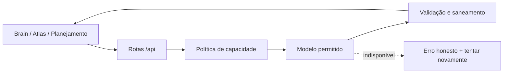

<div align="center">


# Nexus AI 3.0 · Core Reborn

### Um sistema pessoal de execução que transforma objetivos em uma próxima ação clara.

<p>
  <a href="https://github.com/Guuh-dev/Nexus-AI-v2/actions/workflows/ci.yml"></a>
  <a href="https://github.com/Guuh-dev/Nexus-AI-v2/actions/workflows/security.yml"></a>
  
  
  
  
</p>

</div>

## O que é

O Nexus organiza um ciclo simples: entender o objetivo, preparar uma missão diária, executar tarefas observáveis, focar, medir o que aconteceu e ajustar o próximo passo. Ele funciona localmente sem conta e usa inteligência remota somente quando ela está disponível e faz sentido.

```text
Objetivo → missão de hoje → tarefas claras → foco → evidência → revisão → próximo passo
```

A versão 3.0 remove a ideia de um “super app” cheio de painéis incompletos. A navegação principal agora possui cinco áreas:

| Área | Responsabilidade |
| --- | --- |
| Hoje | Missão, tarefas, direção e replanejamento. |
| Brain | Conversa contextual, Professor Atlas e roadmaps. |
| Foco | Sessões de execução com restauração de estado. |
| Progresso | Evidências, métricas e revisão semanal. |
| Perfil | Preferências, dados, atualização e backup. |

Operações, hábitos, semana e finanças saíram da superfície principal porque duplicavam o núcleo ou ainda não tinham profundidade suficiente. Seus dados legados continuam preservados no storage v6 para evitar perda durante a atualização.

## Princípios do Core Reborn

- Uma missão principal por dia.
- Tarefas curtas com contexto, primeira ação, resultado esperado e critério de conclusão.
- Roadmaps diferentes para aprender tecnologia e para vender uma entrega.
- Revisões baseadas em fatos locais; pouca evidência é declarada como pouca evidência.
- Brain e Atlas usam apenas modelos compatíveis com a capacidade solicitada.
- Falha remota aparece como falha remota; não existe conversa local fingindo ser IA.
- Planejamento offline é determinístico, claramente identificado e não inventa comportamento do usuário.
- Ações sugeridas pela IA exigem confirmação antes de alterar o estado.

## Inteligência remota

A chave do provedor existe somente no backend. O cliente envia contexto compacto para as rotas Expo, e o servidor escolhe um modelo a partir de um registro explícito de capacidades.



Classificadores de segurança, moderação, embeddings, rerankers e modelos exclusivos de imagem ou visão não podem responder ao Brain. Modelos retornados por roteadores dinâmicos também são validados antes que qualquer texto chegue à interface. Retry só ocorre em falhas temporárias e pode escolher uma alternativa conversacional permitida.

Telemetria registra código de erro, modelo, tentativas e latência; nunca registra chave, prompt interno ou conteúdo privado completo.

Leia [docs/AI_SYSTEM.md](docs/AI_SYSTEM.md).

## Roadmaps, planejamento e revisão

O Professor Atlas coleta assunto, nível, resultado desejado, prova prática, restrições e tempo disponível. O classificador de intenção separa trilhas técnicas, técnicas aplicadas, comerciais e outros objetivos, sem contaminar um pedido comum de aprendizado com conteúdo de vendas.

Roadmaps podem ser ativados, arquivados e excluídos. A criação só fecha a entrevista depois da persistência; se falhar, o rascunho continua na tela.

O planejamento sintetiza metas longas em linguagem executável. A revisão semanal calcula métricas localmente e aceita da IA apenas afirmações sustentadas pelas evidências enviadas. O score é determinístico e pode ser nulo quando não há dados suficientes.

## Temas

Existem seis temas completos:

- Nexus Dark;
- AMOLED;
- Glass;
- Light;
- Pixel;
- Minimal.

Cada tema define tokens de fundo, superfícies, texto, ação primária, estados semânticos, bordas, sombra, glow, barra de abas e geometria. Temas antigos são convertidos durante a migração.

## Widgets Android

O Widget Studio 3.0 oferece cinco famílias reais:

| Família | Tamanho | Conteúdo |
| --- | --- | --- |
| Mini | 1×1 | Mascote e streak ou XP. |
| Strip | 2×1 | Próxima ação e progresso. |
| Companion | 2×2 | Mascote, personalidade e fala curta. |
| Mission | 4×2 | Missão, até duas tarefas e progresso. |
| Command | 4×4 | Missão, quatro tarefas, foco, progresso e Companion. |

Preview React Native e renderer Android partem do mesmo `WidgetRenderSpec`. Estilo, conteúdo, limites, opacidade, cor, Companion, ação e estado vazio são representados no widget real. Cada `appWidgetId` mantém configuração independente, e salvar força sincronização do payload e redesenho nativo.

Mudanças em Kotlin, XML, Manifest ou plugin exigem um novo APK; não podem ser entregues apenas por OTA. Leia [docs/WIDGETS.md](docs/WIDGETS.md).

## Dados locais e migração

O storage v6 preserva perfil, objetivos, plano, tarefas, progresso, histórico, roadmaps, chats e preferências. Antes de migrar, o app grava um backup versionado. Coleções são recuperadas item a item: uma entrada inválida não apaga todas as entradas válidas da mesma seção.

Dados produzidos por uma versão futura ficam bloqueados contra sobrescrita. Imports passam por limites de tamanho, migração e schemas Zod. O usuário pode exportar e importar um backup JSON pelo Perfil.

## Arquitetura

```text
app/                    Expo Router, cinco abas e rotas de API
components/             UI compartilhada, mensagens, Companion e preview
constants/              defaults, release e registro de modelos
features/               planejamento, roadmaps, revisão, tarefas e widgets
providers/              estado local e mutações atômicas
schemas/                contratos Zod de storage e fronteiras remotas
services/               IA, persistência, status, updates e bridge nativa
modules/nexus-widget/   módulo Android RemoteViews
scripts/                release, secrets e classificação nativa
tests/                  domínio, UI, API, storage, workflows e Android
docs/                   arquitetura, IA, widgets, release e QA
```

Mais detalhes em [docs/ARCHITECTURE.md](docs/ARCHITECTURE.md).

## Executar localmente

Requisitos:

- Node.js `22.13+ <23`;
- pnpm `10.0.0`;
- JDK 17 e Android SDK para o build nativo;
- credenciais Expo apenas para EAS Build ou EAS Update.

```bash
corepack enable
corepack prepare pnpm@10.0.0 --activate
pnpm install --frozen-lockfile
cp .env.example .env
pnpm run web
```

Para habilitar a inteligência remota no servidor:

```env
OPENROUTER_API_KEY=
```

Use uma conta OpenRouter com créditos. As duas rotas fixas de produção exigem ZDR e têm teto de preço aplicado pelo backend.

Nunca use `EXPO_PUBLIC_*` para segredos de IA.

## Validar

```bash
pnpm run typecheck
pnpm run lint
pnpm run test
pnpm run verify
pnpm run release:check
pnpm audit --audit-level=high
pnpm run doctor
pnpm run export:web
pnpm exec expo prebuild --platform android --clean
./android/gradlew :app:assembleDebug
git diff --check
```

O CI executa validação TypeScript, lint, testes, scan de secrets, release check, export web, Expo Doctor, prebuild limpo e compilação Gradle. O workflow de segurança executa audit em nível alto e CodeQL.

## Release

`runtimeVersion` segue `appVersion`. A v3.0.0 inclui mudanças nativas e precisa de um novo APK-base. Depois desse APK, somente alterações compatíveis com o mesmo runtime podem seguir pelos canais OTA.

```text
branch de release → pull request → CI + segurança + detector nativo
  ├─ mudança somente JS compatível → OTA preview → promoção manual
  └─ runtime ou código nativo       → EAS Build → novo APK → nova base
```

Consulte [docs/RELEASE_3_0.md](docs/RELEASE_3_0.md), [docs/ANDROID_QA.md](docs/ANDROID_QA.md) e [docs/DEPLOYMENT.md](docs/DEPLOYMENT.md).
