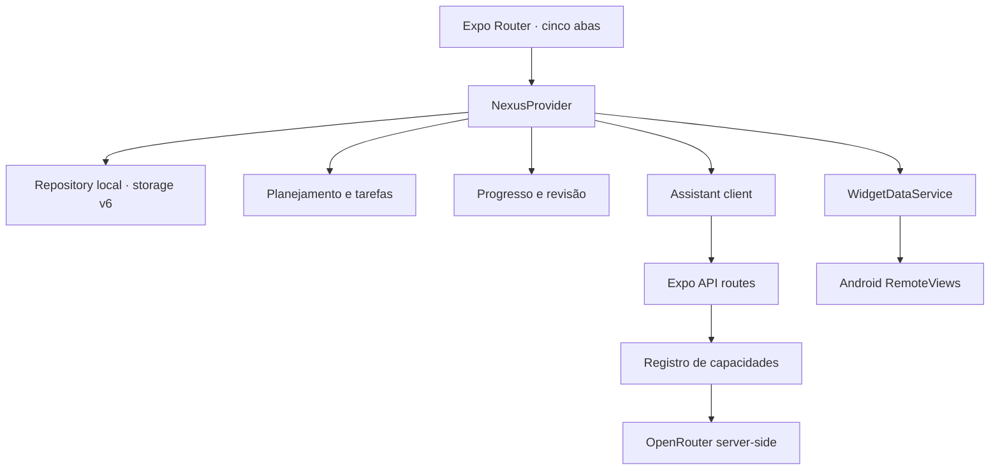

# Arquitetura do Nexus AI 3.0

## Núcleo do produto

Core Reborn organiza o app em cinco experiências: Hoje, Brain, Foco, Progresso e Perfil. Professor Atlas e roadmaps vivem dentro do Brain; aparência e Widget Studio partem do Perfil. Essa composição reduz navegação duplicada sem remover os dados históricos.

## Camadas

- `app/`: telas, layout e rotas HTTP. As rotas não acessam secrets pelo cliente.
- `providers/`: estado em memória, mutações atômicas, persistência e sincronização nativa.
- `features/`: regras determinísticas de tarefas, planejamento, roadmaps, revisão, Companion e widgets.
- `services/`: fronteiras de storage, rede, status, updates e módulo Android.
- `schemas/`: validação Zod para estado persistido e dados remotos.
- `constants/`: defaults, versão e política de modelos.
- `modules/nexus-widget/`: Kotlin, XML e configuração Expo do widget Android.

A UI não deve duplicar regras presentes em `features/` ou `services/`. O backend nunca confia em um identificador de modelo fornecido pelo cliente.

## Limites de confiança

Entradas não confiáveis:

1. formulários e parâmetros de rota;
2. JSON do AsyncStorage ou de backup;
3. respostas do provedor de IA;
4. identificadores retornados por roteadores dinâmicos;
5. ações e configurações vindas do widget Android;
6. variáveis de ambiente e URLs públicas.

Cada fronteira aplica limite de tamanho, forma, enumeração e complexidade. Ações sugeridas pela IA continuam como propostas até a confirmação do usuário. A telemetria não carrega prompt interno, secret ou conteúdo privado completo.

## IA por capacidade

Os modos Brain, Professor, roadmap, captura, revisão e planejamento declaram capacidades diferentes. O servidor monta uma ordem a partir de um registro explícito e valida tanto o modelo solicitado quanto o modelo efetivamente resolvido.

Classificadores de segurança, moderação, embeddings, rerankers e modelos exclusivos de imagem ou visão são bloqueados nos fluxos conversacionais e estruturados. Uma falha temporária pode avançar para outro modelo permitido; autenticação, payload inválido e bloqueios de política não geram retry cego.

Brain e Atlas exibem indisponibilidade remota de forma honesta. O modo offline existe para planejamento determinístico, não para simular uma conversa gerada por IA.

Detalhes em [AI_SYSTEM.md](AI_SYSTEM.md).

## Planejamento e evidência

O contrato de missão e tarefa possui título específico, contexto, primeira ação, resultado esperado e critério de conclusão. A síntese evita copiar uma meta extensa para o card diário.

Roadmaps classificam intenção antes de montar fases. Intenções técnicas não recebem conteúdo comercial automaticamente; objetivos de venda ou clientes usam uma trilha comercial explícita. O nível avançado pula introduções elementares.

A revisão semanal calcula métricas observáveis localmente. Uma resposta remota pode organizar fatos e hipóteses, mas não pode substituir o score determinístico nem criar evidências inexistentes.

## Persistência v6

`NexusRepository` usa a chave estável `@nexus-ai/state`. Ao carregar uma versão anterior, salva um backup em `@nexus-ai/pre-v3.0-backup` antes da conversão.

A migração preserva:

- perfil e diagnóstico;
- plano ativo, tarefas recorrentes e histórico;
- XP, foco, streaks e conquistas;
- conversas e memórias;
- roadmaps e revisões;
- preferências de tema, Companion e widget;
- dados de módulos legados, mesmo ocultos da navegação.

Coleções são validadas item a item. Um item corrompido é ignorado com aviso sem zerar os vizinhos válidos. Um storage com versão maior que a suportada fica bloqueado contra escrita, evitando downgrade destrutivo.

## Temas

`theme/theme.ts` é a fonte única dos seis temas. Cada tema contém tokens semânticos de cor e tokens visuais de geometria, sombra e backdrop. Componentes básicos consomem esses tokens; não definem uma segunda paleta própria. Identificadores antigos são convertidos para o tema v3 mais próximo.

## Widget Android

`WidgetRenderSpec` descreve família, tamanho, conteúdo, campos visíveis, limite de tarefas, cores, opacidade, Companion, ações e estado vazio. O preview React Native e o payload nativo consomem essa mesma especificação.

O módulo mantém configurações por `appWidgetId`. Conclusão de tarefa continua protegida por nonce e consumo idempotente. O código web usa um adaptador no-op e nunca importa Kotlin ou APIs Android.

## Backend

O backend é o export web do Expo servido no Render. `/api/status` é o health check público e informa configuração, versão da API e disponibilidade do assistente sem expor secrets. A chave OpenRouter é a única credencial de IA; a ordem de modelos vem da allowlist e pode apenas ser reordenada por variáveis exclusivas do servidor.

O cliente trata cold start com estado de conexão, timeout limitado e nova tentativa explícita. Indisponibilidade não é escondida por uma resposta local de conversa.

## Release e runtime

`runtimeVersion.policy` usa `appVersion`. O detector nativo classifica mudanças em módulo Android, plugin, configuração Expo ou versão como necessidade de novo APK.

O CI valida TypeScript, lint, testes, secrets, release, export web e dependências Expo. Um job nativo separado executa prebuild Android limpo e `:app:assembleDebug` com JDK 17. EAS Build produz o APK de release; OTA só é permitido quando não existe alteração nativa desde a base instalada.
