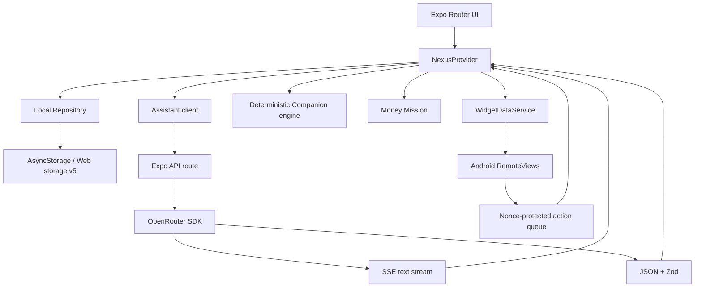

# Arquitetura do Nexus AI 2.2

## Visão geral

## Limites de confiança

1. Interface, AsyncStorage, backup importado e widget actions são entradas não confiáveis.
2. Todo JSON persistido ou recebido por API passa por schema e limites de complexidade.
3. A chave OpenRouter só existe no servidor.
4. Respostas estruturadas da IA passam por extração, parse, Zod e normalização.
5. O widget recebe apenas um payload compacto.
6. Ações propostas por Brain/Atlas exigem confirmação antes de alterar dados.
7. Intents do widget que modificam estado usam nonce e consumo idempotente.

## Assistente

Existem dois caminhos:

### Conversacional

Brain e Atlas usam SSE. O servidor envia eventos `ready`, `delta`, `result` e `error`. A UI mantém uma mensagem transitória durante o stream e substitui por uma mensagem persistida quando o resultado final chega.

### Estruturado

Planejamento, ações e outros contratos usam JSON validado. O cliente envia contexto compactado, o servidor tenta um modelo gratuito compatível e o modo local assume quando a rede ou o provider falham.

A política evita retry em erros permanentes como autenticação e aplica nova tentativa apenas em falhas temporárias.

## Estado local e storage v5

`NexusRepository` isola a UI da implementação de armazenamento. O storage v5 inclui:

- preferências de Companion e Atlas;
- Widget Studio 2.2;
- Money Mission;
- dados anteriores de perfil, plano, progresso, Brain, roadmaps, hábitos, operações e semana.

Migrações criam backup anterior, validam o resultado e recuperam seções corrompidas de forma independente.

Mutações de tarefa são atômicas. XP deriva da transição anterior → próxima, impedindo concessão repetida.

## Companion

O motor em `features/companion` é determinístico e local. Ele escolhe uma linha com base em humor, data e estado do plano, sem abrir uma nova requisição de IA. A presença dentro do app é global, enquanto widgets armazenam humor e fala por instância.

## Professor Atlas

A entrevista registra nível, conceitos, tentativas, objetivo, prova de domínio, prazo, tempo e limitações. O Atlas 2.2 recebe uma personalidade configurável e responde uma etapa por vez, com ação, entrega e critério de conclusão.

## Widget Android

O módulo `modules/nexus-widget` é isolado do bundle web. O provider renderiza `RemoteViews`, mantém preferências por `appWidgetId` e consome um JSON compacto produzido pelo app.

Ações:

- concluir tarefa;
- alternar página;
- abrir uma rota do app.

As duas primeiras validam nonce. A fila de tarefa é consumida atomicamente pelo app para manter XP idempotente.

## OTA e runtime

`runtimeVersion` segue `appVersion`. Código OTA só é entregue a binários com runtime compatível. Como 2.2 altera Kotlin/XML e runtime, ela inaugura uma nova base APK. Atualizações 2.2.x compatíveis podem usar OTA sem tocar no módulo nativo.

## Web e código nativo

Componentes visuais usam primitives React Native. Nenhum array de estilo é encaminhado a elemento DOM. O módulo do widget só é carregado no Android; a implementação web é no-op.
