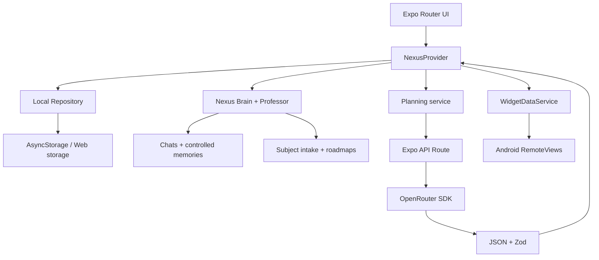

# Arquitetura do Nexus AI

## Visão geral

## Limites de confiança

1. A interface e o armazenamento são ambientes não confiáveis: todo JSON carregado é validado.
2. O endpoint aceita somente perfil e contexto dentro dos limites do schema.
3. A resposta da IA nunca vira código ou estilo; ela passa por extração JSON, parse, Zod, normalização e hidratação.
4. O módulo do widget recebe apenas um payload compacto, sem chave ou perfil completo.
5. Memórias extraídas pela IA são limitadas, validadas, visíveis e removíveis pelo usuário.
6. Ações sugeridas no chat exigem confirmação antes de alterar plano, objetivo ou tarefas.

## Planejamento

O cliente tenta uma única operação com timeout. O servidor usa primeiro `openrouter/free` e finalmente o modo local. A contingência paga `deepseek/deepseek-v4-flash` só é considerada quando `OPENROUTER_ALLOW_PAID_FALLBACK=true` existe exclusivamente no servidor. A resposta é acumulada por streaming e lida somente no servidor. Se o JSON falhar, há uma reparação remota. Se ainda falhar, um gerador local determinístico cria a missão.

## Estado local

`NexusRepository` isola a interface da implementação AsyncStorage. A UI não depende do provedor concreto; uma sincronização futura pode implementar a mesma interface.

As mutações de tarefa são atômicas. O XP deriva da transição anterior → próxima, impedindo concessões repetidas. O estado em memória é atualizado antes da persistência para que toques rápidos usem a versão mais nova.

O storage v4 migra perfil, plano, histórico e XP sem apagá-los, cria um backup anterior à migração e recupera seções corrompidas de forma independente. Conversas completas ficam locais; resumos progressivos e memórias estruturadas mantêm continuidade sem enviar todo o histórico em cada requisição.

## Professor Atlas

O Atlas não gera um roadmap apenas com o nome do assunto. A entrevista registra nível, conceitos conhecidos, tentativas, objetivo, prova de domínio, motivação, prazo, tempo, recursos, limitações e métodos preferidos. Esse diagnóstico permanece anexado ao roadmap e orienta tanto a IA quanto o fallback local.

Quando autorizado, a próxima lição entra no contexto do plano diário e no payload do widget. A integração pode ser desligada separadamente para o plano, conteúdo do widget e personagem do Professor.

## Datas e streak

Datas são chaves locais `YYYY-MM-DD` no fuso do perfil. O rollover arquiva uma data uma única vez, preserva hábitos, carrega até duas pendências prioritárias e cria o próximo plano. Dias sem histórico não destroem automaticamente o streak; um dia arquivado sem atingir a meta encerra a sequência.

## Segurança de contexto

A V2.1 limita tamanho, profundidade, quantidade de nós e chaves por objeto antes de encaminhar contexto ao assistente. Chaves relacionadas a prototype pollution são rejeitadas antes do Zod. O roteador OpenRouter tenta JSON Schema e repete em JSON simples quando um modelo gratuito não oferece structured output.

## Web e código nativo

Componentes visuais usam somente primitives React Native. Nenhum array de estilo é encaminhado a elemento DOM. O widget vive em `modules/nexus-widget` e só é carregado no Android; o módulo web é um no-op.
